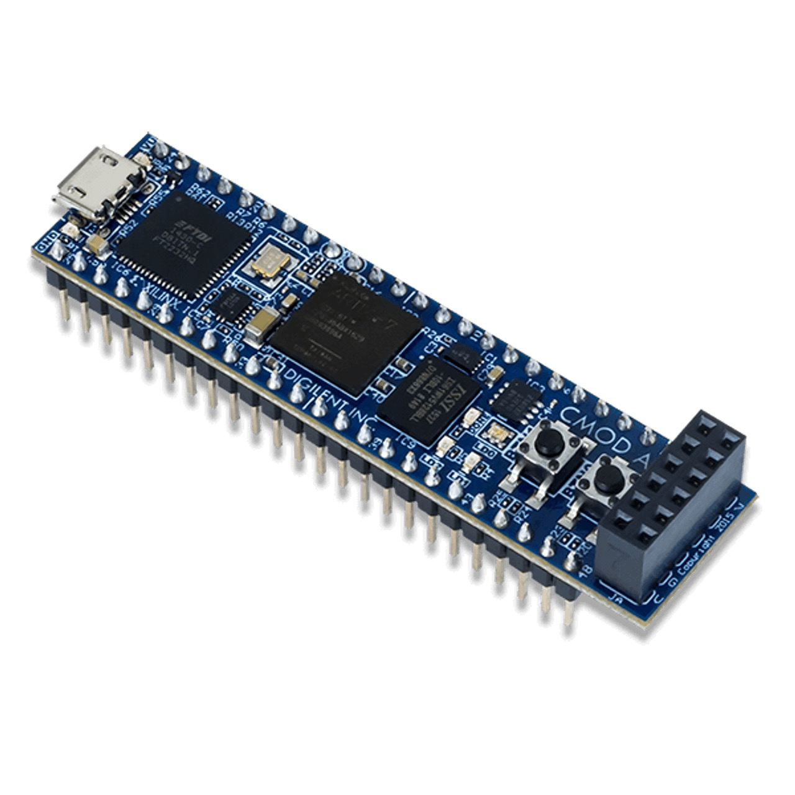

# CMOD A7-35T LED Blinky Example

This project demonstrates building an FPGA bitstream for the Digilent CMOD A7-35T board using the open-source OpenXC7 toolchain. The design is a simple LED blinky that blinks two LEDs at different rates.



*Digilent CMOD A7-35T - Breadboardable Artix-7 FPGA Module (Image: [Digilent Inc.](https://digilent.com/shop/cmod-a7-35t-breadboardable-artix-7-fpga-module/))*

## Hardware Target

- **Board**: Digilent CMOD A7-35T
- **FPGA**: Xilinx Artix-7 xc7a35tcpg236-1
- **Clock**: 12 MHz on-board oscillator

## Design Description

The design (`src/top.v`) implements a simple counter-based LED blinker:

- **Input**: 12 MHz system clock
- **Outputs**: 2 LEDs
  - LED[0]: Blinks at ~0.71 Hz (uses counter bit 23)
  - LED[1]: Blinks at ~1.43 Hz (uses counter bit 22)
- **Logic**: 24-bit counter incremented on each clock cycle

The design uses only 35 FPGA cells and achieves a maximum frequency of 285.55 MHz (23.8x margin over the 12 MHz requirement).

## Prerequisites

### Docker/Colima
This project uses Docker to run the OpenXC7 toolchain. On macOS with Apple Silicon:

```bash
# Install Colima (if not already installed)
brew install colima

# Start Colima with Rosetta 2 for better performance
colima start --arch x86_64 --vm-type=vz --vz-rosetta

# Alternative: Basic x86_64 emulation (slower)
# colima start --arch x86_64
```

**Note**: Rosetta 2 provides significantly better performance than QEMU emulation on Apple Silicon.

### Container Image
The build uses the prebuilt OpenXC7 container:
- `ghcr.io/meriac/openxc7-litex:latest`

## Project Structure

```
cmod7/
├── src/
│   └── top.v                    # Verilog source code
├── constraints/
│   └── cmod_a7.xdc              # Pin constraints and I/O standards
├── sim/                          # Simulation files
│   ├── tb_top.v                 # Full testbench (8M cycles)
│   └── tb_top_quick.v           # Quick testbench (65K cycles)
├── build/                        # Build outputs (generated)
│   ├── blinky.json              # Synthesized netlist (9.1 MB)
│   ├── blinky.fasm              # FPGA assembly (23 KB)
│   ├── blinky.frames            # Frame data (5.3 MB)
│   ├── blinky.bit               # Final bitstream (2.1 MB)
│   ├── xc7a35tcpg236-1.bin      # Device chipdb (88 MB, cached)
│   ├── tb_top_quick.vcd         # Quick simulation waveform
│   └── tb_top.vcd               # Full simulation waveform
├── docker-build.sh              # Main build script
├── simulate.sh                  # Simulation script
└── README.md                    # This file
```

## Build Process

### Quick Start

```bash
# Make build script executable (first time only)
chmod +x docker-build.sh

# Run complete build
./docker-build.sh
```

The script will produce `build/blinky.bit` which can be programmed to the FPGA.

### Build Steps Explained

The build process consists of 5 steps:

#### Step 1: Synthesis (Yosys)
Converts Verilog RTL to a netlist of FPGA primitives:
```bash
yosys -p 'read_verilog src/top.v; \
          synth_xilinx -flatten -abc9 -arch xc7 -top top; \
          write_json build/blinky.json'
```
- **Input**: `src/top.v`
- **Output**: `build/blinky.json` (9.1 MB)
- **Result**: 35 cells (24 FDRE flip-flops, 6 CARRY4, 1 BUFG, etc.)

#### Step 2: Generate Chipdb (bbaexport + bbasm)
Creates a binary device database for the FPGA part (run once, then cached):
```bash
python3 bbaexport.py --device xc7a35tcpg236-1 --bba xc7a35tcpg236-1.bba
bbasm -l xc7a35tcpg236-1.bba xc7a35tcpg236-1.bin
```
- **Output**: `build/xc7a35tcpg236-1.bin` (88 MB)
- **Note**: This step takes a few minutes but only runs once

#### Step 3: Place and Route (NextPNR)
Places and routes the design using the device chipdb:
```bash
nextpnr-xilinx --json build/blinky.json \
               --xdc constraints/cmod_a7.xdc \
               --chipdb build/xc7a35tcpg236-1.bin \
               --fasm build/blinky.fasm
```
- **Inputs**: `build/blinky.json`, `constraints/cmod_a7.xdc`, `build/xc7a35tcpg236-1.bin`
- **Output**: `build/blinky.fasm` (23 KB)
- **Timing**: Max freq 285.55 MHz (PASS at 12.00 MHz target)

#### Step 4: Convert FASM to Frames (fasm2frames)
Converts FPGA assembly to frame data:
```bash
python3 fasm2frames --part xc7a35tcpg236-1 \
                    --db-root prjxray-db/artix7 \
                    build/blinky.fasm \
                    /tmp/blinky.frames
```
- **Input**: `build/blinky.fasm`
- **Output**: `build/blinky.frames` (5.3 MB)
- **Note**: Uses docker cp workaround for permission issues

#### Step 5: Generate Bitstream (xc7frames2bit)
Creates the final bitstream file:
```bash
xc7frames2bit --part_file prjxray-db/artix7/xc7a35tcpg236-1/part.yaml \
              --part_name xc7a35tcpg236-1 \
              --frm_file build/blinky.frames \
              --output_file build/blinky.bit
```
- **Input**: `build/blinky.frames`
- **Output**: `build/blinky.bit` (2.1 MB) - **Ready to program!**

## Simulation

Before building the bitstream, you can simulate the design using Icarus Verilog to verify functionality.

### Prerequisites

Install Icarus Verilog and Surfer waveform viewer:

```bash
# Install Icarus Verilog
# macOS
brew install icarus-verilog

# Ubuntu/Debian
sudo apt-get install iverilog

# Install Surfer (waveform viewer)
cargo install surfer

# Or download prebuilt binaries from:
# https://github.com/surfer-project/surfer/releases
```

### Running Simulation

The project includes two testbenches:

#### Quick Simulation (~65K cycles, <1 second)
```bash
# Make script executable (first time only)
chmod +x simulate.sh

# Run quick simulation
./simulate.sh quick
# or simply
./simulate.sh
```

This runs a fast functional verification that:
- Verifies the counter increments correctly
- Checks LED assignments to counter bits
- Completes in under 1 second
- Generates `build/tb_top_quick.vcd` waveform file

#### Full Simulation (~8M cycles, several minutes)
```bash
./simulate.sh full
```

This runs a complete simulation that:
- Simulates enough cycles to see LED toggles
- Takes several minutes to complete
- Generates `build/tb_top.vcd` waveform file

### Viewing Waveforms

After simulation, view the waveforms with Surfer:

```bash
# Quick simulation waveforms
surfer build/tb_top_quick.vcd

# Full simulation waveforms
surfer build/tb_top.vcd

# Or using make targets
make wave-quick
make wave-full
```

Surfer is a modern, fast waveform viewer with features like:
- Instant loading of large VCD files
- Smooth zooming and panning
- Search and filter capabilities
- Dark/light theme support
- Cross-platform (macOS, Linux, Windows)

### Simulation Output

Example output from quick simulation:
```
=================================================
LED Blinky Quick Testbench
=================================================
Clock: 12 MHz (period = 83.33 ns)
Simulation will run for 65536 cycles
=================================================

Simulation Results:
-------------------------------------------------
Cycles simulated: 65538
Final counter value: 0x010002 (65538)
LED[0] state: 0
LED[1] state: 0
PASS: Counter incremented correctly
PASS: LED[0] correctly assigned to counter[23]
PASS: LED[1] correctly assigned to counter[22]
=================================================
```

## Programming the FPGA

### Option 1: Using OpenOCD (Open-Source)

```bash
# Install OpenOCD
brew install openocd

# Program the bitstream
openocd -f board/digilent_arty.cfg -c "init; pld load 0 build/blinky.bit; exit"
```

### Option 2: Using openFPGALoader

```bash
# Install openFPGALoader
brew install openfpgaloader

# Program to SRAM (temporary)
openFPGALoader -b cmoda7_35t build/blinky.bit

# Program to Flash (persistent)
openFPGALoader -b cmoda7_35t -f build/blinky.bit
```

### Option 3: Using Digilent Tools

1. Install [Digilent Adept](https://digilent.com/reference/software/adept/start)
2. Connect the CMOD A7 board via USB
3. Use Adept to program `build/blinky.bit`

### Option 4: Using Vivado Hardware Manager

1. Open Vivado Hardware Manager
2. Connect to the board
3. Program device with `build/blinky.bit`

## Pin Assignments

| Signal | Pin  | Location       | I/O Standard |
|--------|------|----------------|--------------|
| clk    | L17  | 12 MHz Clock   | LVCMOS33     |
| led[0] | A17  | LED0 (Green)   | LVCMOS33     |
| led[1] | C16  | LED1 (Green)   | LVCMOS33     |

See `constraints/cmod_a7.xdc` for complete pin definitions.

## Expected Behavior

After programming, you should see:
- **LED[0]**: Blinking slowly at approximately 0.71 Hz
- **LED[1]**: Blinking faster at approximately 1.43 Hz (twice the rate of LED[0])

## Troubleshooting

### Build fails with "permission denied" errors
Make sure the build directory is writable:
```bash
chmod 777 build/
```

### Docker/Colima not running
Start Colima with Rosetta 2 (recommended for Apple Silicon):
```bash
colima start --arch x86_64 --vm-type=vz --vz-rosetta
```

### Chipdb generation is slow
This is normal - chipdb generation takes 2-3 minutes and creates an 88 MB file. The file is cached in `build/` so subsequent builds skip this step.

### "command not found" errors in container
The docker-build.sh script sets up the correct PATH. If running commands manually, ensure:
```bash
PATH="/home/builder/.local/bin:/usr/local/bin:/usr/bin:/bin"
```

## Build Times (Apple M3 Max via x86_64 emulation)

- Step 1 (Synthesis): ~30 seconds
- Step 2 (Chipdb): ~2-3 minutes (first time only, then cached)
- Step 3 (Place & Route): ~5 seconds
- Step 4 (FASM to Frames): ~1 second
- Step 5 (Bitstream): <1 second

**Total**: ~40 seconds (with chipdb cached)

## Resource Utilization

```
SLICE_LUTX:    49/65200     0%
SLICE_FFX:     24/65200     0%
CARRY4:         6/ 8150     0%
BUFGCTRL:       1/   32     3%
PAD:            3/  730     0%
```

This minimal design uses less than 1% of the FPGA's resources.

## Build Script Details

The `docker-build.sh` script automates the entire build process using the OpenXC7 container. Key features:

- **Automatic caching**: Chipdb is generated once and reused
- **Permission handling**: Uses docker cp workaround for fasm2frames
- **Path configuration**: Sets up correct paths for all tools
- **Error handling**: Exits on first error with `set -e`

### Customizing the Build

To modify the design for a different part or project:

1. **Change the FPGA part**:
   ```bash
   PART="xc7a35tcpg236-1"  # Update to your target device
   ```

2. **Change project name**:
   ```bash
   PROJECT="blinky"  # Update to your project name
   ```

3. **Update source files**: Modify `src/top.v` and `constraints/cmod_a7.xdc`

## Tools and Versions

This project uses the following open-source tools (via the meriac/openxc7-litex container):

- **Yosys**: RTL synthesis (0.40+33)
- **NextPNR**: Place and route (nextpnr-xilinx)
- **Project X-Ray (prjxray)**: Bitstream database and tools
- **bbaexport/bbasm**: Device database generation
- **fasm2frames**: FASM to frame conversion
- **xc7frames2bit**: Bitstream generation

## Next Steps

Once you have this basic example working, you can:
- Add button inputs to control the LEDs
- Experiment with the RGB LED
- Implement PWM for LED brightness control
- Add UART communication
- Create more complex designs

## References

- [OpenXC7 Project](https://github.com/openXC7)
- [Project X-Ray](https://github.com/f4pga/prjxray)
- [Yosys](https://github.com/YosysHQ/yosys)
- [NextPNR](https://github.com/YosysHQ/nextpnr)
- [CMOD A7 Reference Manual](https://digilent.com/reference/programmable-logic/cmod-a7/reference-manual)
- [CMOD A7 Schematic](https://digilent.com/reference/programmable-logic/cmod-a7/start)
- [meriac/openxc7-litex Container](https://github.com/meriac/openxc7-litex)

## License

This example project is provided as-is for educational purposes.

## Acknowledgments

- OpenXC7 team for the open-source Xilinx 7-series toolchain
- meriac for the prebuilt openxc7-litex container
- Digilent for the CMOD A7 board and documentation
- Project X-Ray contributors for reverse-engineering the bitstream format
