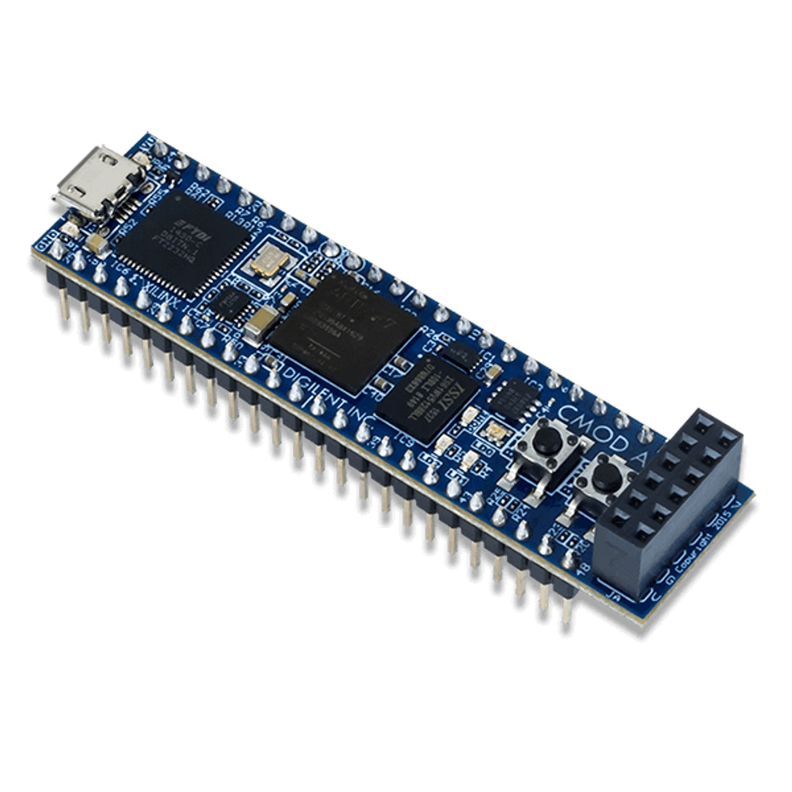

# FPGA Blinky — CMOD A7 / DE10-Nano

Counter-driven LED blinker with PWM output and UART register interface, targeting two FPGA boards with a shared RTL library.



*Digilent CMOD A7-35T (Image: [Digilent Inc.](https://digilent.com/shop/cmod-a7-35t-breadboardable-artix-7-fpga-module/))*

## Supported Platforms

| Platform | FPGA | Toolchain | Doc |
|----------|------|-----------|-----|
| Digilent CMOD A7-35T | Xilinx Artix-7 xc7a35tcpg236-1 | **Vivado** (preferred) or OpenXC7 (open-source) | [platforms/cmod_a7/](platforms/cmod_a7/README.md) |
| Terasic DE10-Nano | Intel Cyclone V 5CSEBA6U23I7 | Quartus Prime Lite | [platforms/de10_nano/](platforms/de10_nano/README.md) |

## Design

Each platform's `top.v` instantiates the same shared modules:

- **`library/uart/uart_rx.v`** / **`uart_tx.v`** — 8N1 UART, parameterized (CLK_FREQ/BAUD_RATE)
- **`src/reg_ctrl.v`** — 4-state FSM (IDLE → ADDR → WDATA → RESP); implements Ping/Read/Write over a byte protocol
- **`src/pwm_generator.v`** — duty-cycle comparator; auto-breathes or follows UART-written register

A free-running counter drives LEDs and PWM in auto mode; UART commands switch to manual control.

### UART Register Protocol

8N1, 115200 baud. All platforms use the same protocol:

| Command | Send | Receive |
|---------|------|---------|
| Ping | `'P'` | `'P'` |
| Read | `'R' ADDR` | `'A' ADDR DATA` or `'N' ADDR` |
| Write | `'W' ADDR DATA` | `'A' ADDR DATA` or `'N' ADDR` |

### Register Map

| Addr | Name | R/W | Description |
|------|------|-----|-------------|
| 0x00 | LED_CTRL | R/W | bit[1:0] = LED[1:0] (manual mode) |
| 0x01 | LED_MODE | R/W | 0 = auto blink, 1 = manual |
| 0x02 | PWM_DUTY | R/W | manual PWM duty 0–255 |
| 0x03 | PWM_MODE | R/W | 0 = auto breathing, 1 = manual |
| 0x04 | CNT_HI | RO | counter[23:16] |
| 0x05 | CNT_MID | RO | counter[15:8] |
| 0x06 | CNT_LO | RO | counter[7:0] |
| 0x07 | VERSION | RO | board ID (0xA7 = CMOD A7) |

See [library/uart/docs/register-interface.md](library/uart/docs/register-interface.md) for the full protocol reference, Python examples, and Verilog integration guide.

### Host Tool

```bash
python tools/reg_access.py /dev/tty.usbserial-XXXXB ping
python tools/reg_access.py /dev/tty.usbserial-XXXXB write 0x01 1   # manual LED mode
python tools/reg_access.py /dev/tty.usbserial-XXXXB read 0x07      # read VERSION
```

Requires `pyserial`.

## Quick Start

### CMOD A7 (Vivado)

```bash
./build-vivado.sh
openFPGALoader -b cmoda7_35t build/vivado/blinky.bit
```

### CMOD A7 (OpenXC7, open-source)

```bash
colima start --arch x86_64 --vm-type=vz --vz-rosetta
./docker-build.sh
openFPGALoader -b cmoda7_35t build/blinky.bit
```

### DE10-Nano (Quartus)

```bash
cd platforms/de10_nano && ./build.sh
openFPGALoader -b de10nano output_files/de10_nano.sof
```

## Simulation

Three simulators are supported — all accept `quick` (default), `full`, and `uart` testbench modes:

| Script | Simulator | Best for |
|--------|-----------|----------|
| `./simulate-vivado.sh [mode]` | Vivado xsim | Matches synthesis semantics |
| `./simulate.sh [mode]` | Icarus Verilog | Lightweight, fast |
| `./simulate-verilator.sh [mode]` | Verilator | High-speed long runs |

```bash
./simulate.sh                # quick testbench, <1s
./simulate.sh uart           # UART register integration test
./simulate-vivado.sh uart    # same test via xsim

make sim-quick               # Icarus quick
make wave-uart               # View UART waveform in Surfer
```

### Installing Simulation Prerequisites

```bash
# Icarus Verilog
brew install icarus-verilog          # macOS
sudo apt-get install iverilog        # Ubuntu/Debian

# Surfer waveform viewer
cargo install surfer
```

Vivado xsim is bundled with Vivado. Verilator: `brew install verilator`.

## Repository Structure

```
platforms/
  cmod_a7/        # Artix-7: top.v, cmod_a7.xdc, build.sh, README.md, PINOUT.md
  de10_nano/      # Cyclone V: top.v, de10_nano.qsf/qpf/sdc, build.sh, README.md
src/
  reg_ctrl.v      # UART register controller FSM
  pwm_generator.v # PWM duty-cycle comparator
library/
  uart/           # Shared uart_rx.v / uart_tx.v + docs/
sim/              # Shared testbenches (tb_top*.v, tb_uart_reg.v)
tools/
  reg_access.py   # Python CLI for UART register access
docker/
  quartus/        # Docker + Colima setup for Quartus on macOS
build-vivado.sh   # Vivado synthesis + implementation (CMOD A7)
docker-build.sh   # OpenXC7 Docker build (CMOD A7)
simulate.sh       # Icarus Verilog runner
simulate-vivado.sh
simulate-verilator.sh
```

## Troubleshooting

**Vivado not found**: Edit `build-vivado.sh` — set `VIVADO_SETTINGS` to match your install path.

**Colima not running** (OpenXC7 flow):
```bash
colima start --arch x86_64 --vm-type=vz --vz-rosetta
```

**Build permission errors** (OpenXC7 flow):
```bash
chmod 777 build/
```

**Chipdb generation is slow**: Normal — it takes 2–3 minutes and produces an 88 MB file. The file is cached in `build/` and subsequent builds skip this step.

## References

- [OpenXC7 Project](https://github.com/openXC7)
- [Project X-Ray](https://github.com/f4pga/prjxray)
- [Yosys](https://github.com/YosysHQ/yosys)
- [NextPNR](https://github.com/YosysHQ/nextpnr)
- [meriac/openxc7-litex Container](https://github.com/meriac/openxc7-litex)
- [CMOD A7 Reference Manual](https://digilent.com/reference/programmable-logic/cmod-a7/reference-manual)
- [DE10-Nano User Manual](https://ftp.intel.com/Public/Pub/fpgaup/pub/Intel_Material/Boards/DE10-Nano/DE10_Nano_User_Manual.pdf)
- [Quartus Prime Lite Download](https://www.intel.com/content/www/us/en/software-kit/825278/)
- [openFPGALoader](https://github.com/trabucayre/openFPGALoader)

## License

This project is provided as-is for educational purposes.
