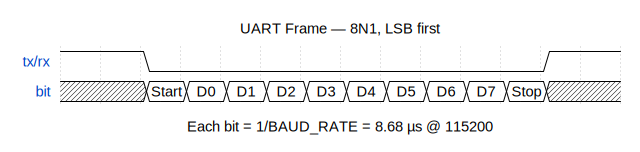

# UART Register Interface — Block Diagram

## System Overview

```
  ┌─────────────────────────────────────────────────────────────────────────┐
  │  Host PC                                                               │
  │                                                                        │
  │  ┌──────────────┐    ┌──────────────────────────────────────────────┐  │
  │  │  Terminal     │    │  Python Script (tools/reg_access.py)        │  │
  │  │  (screen,     │    │                                             │  │
  │  │   minicom)    │    │  ping()  read_reg(addr)  write_reg(addr,d)  │  │
  │  └──────┬───────┘    └──────────────────┬───────────────────────────┘  │
  │         │                               │                              │
  │         └───────────┬───────────────────┘                              │
  │                     │  Serial: 115200 baud, 8N1                        │
  │                     │  /dev/tty.usbserial-*  (Mac)                     │
  │                     │  /dev/ttyUSB1          (Linux)                    │
  │                     │  COM port              (Windows)                  │
  └─────────────────────┼──────────────────────────────────────────────────┘
                        │
                   USB Micro-B
                        │
  ┌─────────────────────┼──────────────────────────────────────────────────┐
  │  CMOD A7-35T Board  │                                                  │
  │                     │                                                  │
  │            ┌────────┴────────┐                                         │
  │            │  FTDI FT2232HL  │                                         │
  │            │                 │                                         │
  │            │  Channel A ─────┼──── JTAG (programming)                  │
  │            │  Channel B ─────┼──┐  UART                                │
  │            └─────────────────┘  │                                      │
  │                                 │                                      │
  │              TX to FPGA (J17) ──┘                                      │
  │              RX from FPGA (J18) ─┐                                     │
  │                                  │                                     │
  │  ┌───────────────────────────────┼────────────────────────────────┐    │
  │  │  FPGA (XC7A35T)              │                                 │    │
  │  │                              │                                 │    │
  │  │         ┌────────────────────┴──────────────────────┐          │    │
  │  │         │              top.v                        │          │    │
  │  │         │                                           │          │    │
  │  │  J17 ───┤►  ┌──────────┐    ┌──────────────────┐   │          │    │
  │  │         │   │ uart_rx  │    │    reg_ctrl       │   │          │    │
  │  │         │   │          │    │                   │   │          │    │
  │  │         │   │ rx ► ──data──►│ rx_data           │   │          │    │
  │  │         │   │     valid──►│ rx_valid           │   │          │    │
  │  │         │   └──────────┘    │                   │   │          │    │
  │  │         │                   │  ┌─────────────┐  │   │          │    │
  │  │         │                   │  │ Register    │  │   │          │    │
  │  │         │                   │  │ File        │  │   │          │    │
  │  │         │                   │  │             │  │   │          │    │
  │  │         │                   │  │ 0: LED_CTRL │  │   │          │    │
  │  │         │                   │  │ 1: LED_MODE │──┼──►│ LEDs     │    │
  │  │         │                   │  │ 2: PWM_DUTY │──┼──►│ PWM      │    │
  │  │         │                   │  │ 3: PWM_MODE │  │   │          │    │
  │  │         │                   │  │ 4: CNT_HI   │◄─┼──│ counter  │    │
  │  │         │                   │  │ 5: CNT_MID  │  │   │          │    │
  │  │         │                   │  │ 6: CNT_LO   │  │   │          │    │
  │  │         │                   │  │ 7: VERSION  │  │   │          │    │
  │  │         │                   │  └─────────────┘  │   │          │    │
  │  │         │   ┌──────────┐    │                   │   │          │    │
  │  │         │   │ uart_tx  │    │          tx_data──►│   │          │    │
  │  │         │   │          │◄──valid   tx_valid──►│   │          │    │
  │  │  J18 ◄──┤   │ tx ◄ ──data◄──┤   tx_ready◄──│   │          │    │
  │  │         │   └──────────┘    └──────────────────┘   │          │    │
  │  │         │                                           │          │    │
  │  │         │   ┌───────────────┐                       │          │    │
  │  │         │   │ pwm_generator │◄── duty cycle         │          │    │
  │  │         │   └───────┬───────┘                       │          │    │
  │  │         │           │ pwm_out                       │          │    │
  │  │         └───────────┼───────────────────────────────┘          │    │
  │  │                     │                                          │    │
  │  └─────────────────────┼──────────────────────────────────────────┘    │
  │                        │                                               │
  │              LED[0] (A17)   LED[1] (C16)   PIO1/PWM (M3)              │
  └────────────────────────────────────────────────────────────────────────┘
```

## Data Flow

```
  Host PC                    FPGA
  ═══════                    ════

  Write register:

  ┌──────────┐               ┌──────────┐    ┌──────────┐    ┌──────────┐
  │ Send     │   UART line   │ uart_rx  │    │ reg_ctrl │    │ Register │
  │ W|ADDR|  ├──────────────►│ deserial ├───►│ FSM      ├───►│ File     │
  │ DATA     │   (serial)    │ ize      │    │ parse    │    │ write    │
  └──────────┘               └──────────┘    └────┬─────┘    └──────────┘
                                                   │
  ┌──────────┐               ┌──────────┐         │
  │ Receive  │   UART line   │ uart_tx  │◄────────┘
  │ A|ADDR|  │◄──────────────┤ serial   │  A|ADDR|DATA
  │ DATA     │   (serial)    │ ize      │  (ACK response)
  └──────────┘               └──────────┘


  Read register:

  ┌──────────┐               ┌──────────┐    ┌──────────┐    ┌──────────┐
  │ Send     │   UART line   │ uart_rx  │    │ reg_ctrl │    │ Register │
  │ R|ADDR   ├──────────────►│ deserial ├───►│ FSM      ├───►│ File     │
  │          │   (serial)    │ ize      │    │ parse    │    │ read     │
  └──────────┘               └──────────┘    └────┬─────┘    └──────────┘
                                                   │
  ┌──────────┐               ┌──────────┐         │
  │ Receive  │   UART line   │ uart_tx  │◄────────┘
  │ A|ADDR|  │◄──────────────┤ serial   │  A|ADDR|DATA
  │ DATA     │   (serial)    │ ize      │  (ACK + read data)
  └──────────┘               └──────────┘
```

## UART Module Interfaces

```
                  uart_tx                              uart_rx
          ┌──────────────────┐                 ┌──────────────────┐
          │                  │                 │                  │
  clk ───►│                  │         clk ───►│                  │
  rst ───►│                  │         rst ───►│                  │
          │                  │                 │                  │
 data_i ─►│  [7:0]     tx  ─┼──► serial  ───►─┼── rx    [7:0]   ├──► data_o
valid_i ─►│                  │                 │        valid_o  ├──► valid_o
ready_o ◄─┤                  │                 │                  │
          │                  │                 │                  │
          └──────────────────┘                 └──────────────────┘

  Handshake:                        Output:
  Assert valid_i when ready_o=1     data_o valid for 1 clk
  data_i latched on that cycle      when valid_o pulses high
```

## UART Frame Format (8N1)

At 115200 baud: ~8.68 µs per bit, ~86.8 µs per byte.



<!-- wavedrom source (regenerate with: npx wavedrom-cli -i input.json -s img/uart-frame.svg)
```json
{ "signal": [
  { "name": "tx/rx",
    "wave": "1.0.........1." },
  { "name": "bit",
    "wave": "x.2222222222x.",
    "data": ["Start", "D0", "D1", "D2", "D3", "D4", "D5", "D6", "D7", "Stop"] }
],
  "head": { "text": "UART Frame — 8N1, LSB first" },
  "foot": { "text": "Each bit = 1/BAUD_RATE = 8.68 µs @ 115200" }
}
```
-->

## reg_ctrl FSM States

```
         ┌──────┐
    ─────► IDLE │◄──────────────────────────────────┐
         └──┬───┘                                    │
            │ rx_valid                               │
            │ (byte received)                        │
            ▼                                        │
         ┌──────┐                                    │
         │ CMD  │  Latch command byte                │
         └──┬───┘  ('P','R','W' or discard)          │
            │                                        │
       ┌────┼──────────┐                             │
       │    │          │                             │
       ▼    ▼          ▼                             │
     'P'   'R'        'W'                            │
       │    │          │                             │
       │    ▼          ▼                             │
       │ ┌──────┐  ┌──────┐                          │
       │ │ ADDR │  │ ADDR │  Wait for address byte   │
       │ └──┬───┘  └──┬───┘                          │
       │    │         │                              │
       │    │         ▼                              │
       │    │     ┌──────┐                           │
       │    │     │ DATA │  Wait for data byte       │
       │    │     └──┬───┘  (write to register)      │
       │    │        │                               │
       ▼    ▼        ▼                               │
      ┌──────────────────┐                           │
      │ RESPOND          │  Send response bytes      │
      │ (1-3 bytes via   │  via uart_tx              │
      │  uart_tx)        ├───────────────────────────┘
      └──────────────────┘
```
