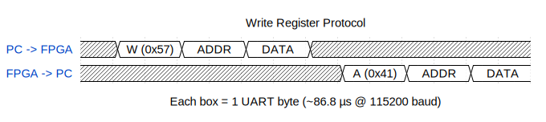
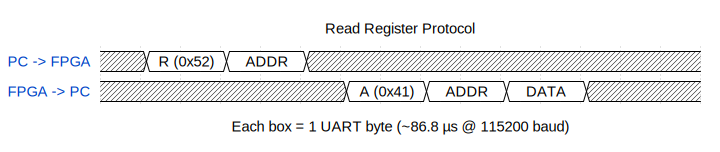
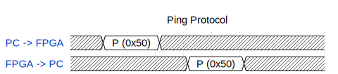
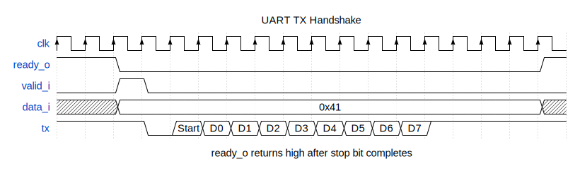
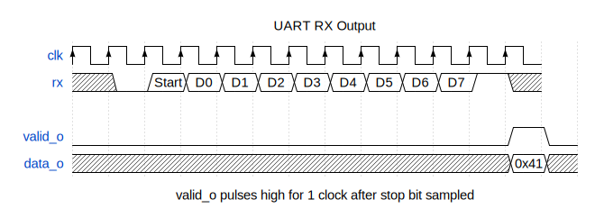

# UART Register Interface — Usage Guide

## Overview

This interface lets a host PC read and write 8-bit registers inside the FPGA
over the USB connection on the CMOD A7-35T board. No additional hardware is
needed — the onboard FTDI FT2232HL USB bridge provides a virtual serial port
that the FPGA accesses via two pins.

**Settings**: 115200 baud, 8 data bits, no parity, 1 stop bit (8N1)

## Hardware Connection

| Signal | FPGA Pin | Direction (FPGA perspective) | XDC Port Name |
|--------|----------|------------------------------|---------------|
| RX (data from PC) | J17 | Input | `uart_rxd_in` |
| TX (data to PC) | J18 | Output | `uart_txd_out` |

Both pins are Bank 14, LVCMOS33. Add to your XDC file:

```tcl
set_property -dict { PACKAGE_PIN J18   IOSTANDARD LVCMOS33 } [get_ports { uart_txd_out }];
set_property -dict { PACKAGE_PIN J17   IOSTANDARD LVCMOS33 } [get_ports { uart_rxd_in  }];
```

> **Pin naming**: Digilent's XDC names these from the FTDI chip's perspective
> (`uart_txd_in` = FTDI's TX going into the FPGA). The names above are from
> the FPGA's perspective to avoid confusion in your Verilog.

## Register Map

| Addr | Name | R/W | Reset | Description |
|------|----------|-----|-------|--------------------------------------|
| 0x00 | LED_CTRL | R/W | 0x00 | LED override: bit 0 = LED[0], bit 1 = LED[1] |
| 0x01 | LED_MODE | R/W | 0x00 | 0 = auto (counter blink), 1 = manual (use LED_CTRL) |
| 0x02 | PWM_DUTY | R/W | 0x00 | PWM duty cycle 0–255 (manual mode) |
| 0x03 | PWM_MODE | R/W | 0x00 | 0 = auto (breathing), 1 = manual (use PWM_DUTY) |
| 0x04 | CNT_HI | RO | — | counter[23:16] snapshot |
| 0x05 | CNT_MID | RO | — | counter[15:8] snapshot |
| 0x06 | CNT_LO | RO | — | counter[7:0] snapshot |
| 0x07 | VERSION | RO | 0xA7 | Board identifier (0xA7 = CMOD A7) |

Writes to read-only registers are silently ignored. The register value is
echoed back in the ACK response, so you can verify the write took effect.

## Protocol

All commands use printable ASCII characters for the command byte. Address and
data bytes are raw binary (0x00–0xFF).

### Ping

Verify the link is alive.

```
PC sends:    P                    (1 byte:  0x50)
FPGA sends:  P                    (1 byte:  0x50)
```

### Read Register

```
PC sends:    R  ADDR              (2 bytes: 0x52, address)
FPGA sends:  A  ADDR  DATA       (3 bytes: 0x41, address, register value)
```

### Write Register

```
PC sends:    W  ADDR  DATA       (3 bytes: 0x57, address, value)
FPGA sends:  A  ADDR  DATA       (3 bytes: 0x41, address, value written)
```

### Error (invalid address)

If the address is outside 0x00–0x07:

```
FPGA sends:  N  ADDR             (2 bytes: 0x4E, bad address)
```

### Byte-Level Timing

Round-trip for one register write: ~6 × 86.8 µs ≈ 0.52 ms

**Write transaction:**



**Read transaction:**



**Ping transaction:**



<!-- wavedrom source: write protocol (regenerate: npx wavedrom-cli -i input.json -s img/protocol-write.svg)
```json
{ "signal": [
  { "name": "PC -> FPGA",
    "wave": "x2.2.2.x......",
    "data": ["W (0x57)", "ADDR", "DATA"] },
  { "name": "FPGA -> PC",
    "wave": "x......x2.2.2.",
    "data": ["A (0x41)", "ADDR", "DATA"] }
],
  "head": { "text": "Write Register Protocol" },
  "foot": { "text": "Each box = 1 UART byte (~86.8 µs @ 115200 baud)" }
}
```
-->

<!-- wavedrom source: read protocol (regenerate: npx wavedrom-cli -i input.json -s img/protocol-read.svg)
```json
{ "signal": [
  { "name": "PC -> FPGA",
    "wave": "x2.2.x.........",
    "data": ["R (0x52)", "ADDR"] },
  { "name": "FPGA -> PC",
    "wave": "x....x2.2.2.x..",
    "data": ["A (0x41)", "ADDR", "DATA"] }
],
  "head": { "text": "Read Register Protocol" },
  "foot": { "text": "Each box = 1 UART byte (~86.8 µs @ 115200 baud)" }
}
```
-->

<!-- wavedrom source: ping protocol (regenerate: npx wavedrom-cli -i input.json -s img/protocol-ping.svg)
```json
{ "signal": [
  { "name": "PC -> FPGA",
    "wave": "x2.x.....",
    "data": ["P (0x50)"] },
  { "name": "FPGA -> PC",
    "wave": "x..x2.x..",
    "data": ["P (0x50)"] }
],
  "head": { "text": "Ping Protocol" }
}
```
-->

## Usage Examples

### With Python (pyserial)

```python
import serial

ser = serial.Serial('/dev/tty.usbserial-XXXXB', 115200, timeout=1)

# Ping
ser.write(b'P')
assert ser.read(1) == b'P'

# Read VERSION register (addr 0x07)
ser.write(b'R' + bytes([0x07]))
resp = ser.read(3)                      # b'A' + addr + data
assert resp[0:1] == b'A'
print(f"Version: 0x{resp[2]:02X}")      # 0xA7

# Write LED_MODE = manual
ser.write(b'W' + bytes([0x01, 0x01]))
resp = ser.read(3)                      # ACK

# Write LED_CTRL = LED[0] on, LED[1] off
ser.write(b'W' + bytes([0x00, 0x01]))
resp = ser.read(3)

# Write LED_CTRL = LED[1] on, LED[0] off
ser.write(b'W' + bytes([0x00, 0x02]))
resp = ser.read(3)

# Read counter
ser.write(b'R' + bytes([0x04]))
hi = ser.read(3)[2]
ser.write(b'R' + bytes([0x05]))
mid = ser.read(3)[2]
ser.write(b'R' + bytes([0x06]))
lo = ser.read(3)[2]
counter = (hi << 16) | (mid << 8) | lo
print(f"Counter: {counter}")

ser.close()
```

### With a Terminal (screen / minicom)

The command bytes are printable ASCII, so you can test basic connectivity
from any terminal emulator:

```bash
# Mac
screen /dev/tty.usbserial-XXXXB 115200

# Linux
screen /dev/ttyUSB1 115200
```

Type `P` and you should see `P` echoed back immediately. Reading and writing
registers requires sending raw bytes for address and data, which is easier
with the Python script or a tool like `miniterm --raw`.

### With the CLI Tool (tools/reg_access.py)

```bash
# Ping
python tools/reg_access.py /dev/tty.usbserial-XXXXB ping

# Read register
python tools/reg_access.py /dev/tty.usbserial-XXXXB read 0x07

# Write register
python tools/reg_access.py /dev/tty.usbserial-XXXXB write 0x01 1
```

## Verilog Integration

### Instantiating the UART Modules

```verilog
wire [7:0] rx_data;
wire       rx_valid;
wire [7:0] tx_data;
wire       tx_valid;
wire       tx_ready;

uart_rx #(
    .CLK_FREQ(12_000_000),
    .BAUD_RATE(115_200)
) uart_rx_inst (
    .clk(clk),
    .rst(rst),
    .rx(uart_rxd_in),
    .data_o(rx_data),
    .valid_o(rx_valid)
);

uart_tx #(
    .CLK_FREQ(12_000_000),
    .BAUD_RATE(115_200)
) uart_tx_inst (
    .clk(clk),
    .rst(rst),
    .data_i(tx_data),
    .valid_i(tx_valid),
    .ready_o(tx_ready),
    .tx(uart_txd_out)
);
```

### UART TX Handshake

The transmitter uses a simple ready/valid handshake:

1. Wait for `ready_o == 1` (TX is idle)
2. Place your byte on `data_i` and assert `valid_i` for one clock cycle
3. `ready_o` drops to 0 while the byte is being serialized
4. After the stop bit, `ready_o` returns to 1



<!-- wavedrom source: TX handshake (regenerate: npx wavedrom-cli -i input.json -s img/tx-handshake.svg)
```json
{ "signal": [
  { "name": "clk",
    "wave": "P................." },
  { "name": "ready_o",
    "wave": "1.0..............1" },
  { "name": "valid_i",
    "wave": "0.10.............." },
  { "name": "data_i",
    "wave": "x.2..............x",
    "data": ["0x41"] },
  { "name": "tx",
    "wave": "1..02222222221....",
    "data": ["Start", "D0", "D1", "D2", "D3", "D4", "D5", "D6", "D7", "Stop"] }
],
  "head": { "text": "UART TX Handshake" },
  "foot": { "text": "ready_o returns high after stop bit completes" }
}
```
-->

### UART RX Output

The receiver pulses `valid_o` high for exactly one clock cycle when a byte
is received. `data_o` holds the byte value during that cycle.



<!-- wavedrom source: RX output (regenerate: npx wavedrom-cli -i input.json -s img/rx-output.svg)
```json
{ "signal": [
  { "name": "clk",
    "wave": "P............" },
  { "name": "rx",
    "wave": "x02222222221x",
    "data": ["Start", "D0", "D1", "D2", "D3", "D4", "D5", "D6", "D7", "Stop"] },
  {},
  { "name": "valid_o",
    "wave": "0...........10" },
  { "name": "data_o",
    "wave": "x...........2x",
    "data": ["0x41"] }
],
  "head": { "text": "UART RX Output" },
  "foot": { "text": "valid_o pulses high for 1 clock after stop bit sampled" }
}
```
-->

Your logic should capture `data_o` on the clock edge where `valid_o` is high.

## Resource Usage

At 12 MHz / 115200 baud on the XC7A35T:

| Module | LUTs | FFs | Notes |
|--------|------|-----|-------|
| uart_tx | ~30 | ~20 | Shift register + counter |
| uart_rx | ~40 | ~25 | Synchronizer + shift register + counter |
| reg_ctrl | ~80 | ~50 | FSM + 8×8 register file |
| **Total** | **~150** | **~95** | **< 0.5% of XC7A35T** |

## Upgrading Baud Rate

The modules are parameterized. To increase speed:

1. Change `BAUD_RATE` parameter in both `uart_rx` and `uart_tx` instantiations
2. Update the host-side serial port baud rate to match
3. For rates above ~500 kbaud at 12 MHz, add a PLL to generate a faster
   internal clock (48–96 MHz) for adequate sampling resolution

| Baud Rate | Clocks/Bit at 12 MHz | Throughput | PLL Needed? |
|-----------|---------------------|------------|-------------|
| 115,200 | 104 | ~11.5 KB/s | No |
| 921,600 | 13 | ~92 KB/s | Recommended |
| 3,000,000 | 4 | ~300 KB/s | Yes |

## File Locations

```
library/uart/
├── uart_tx.v           Transmitter module
├── uart_rx.v           Receiver module
├── tb_uart.v           Loopback unit test
└── docs/
    ├── block-diagram.md       This system's block diagram
    └── register-interface.md  This document
```
