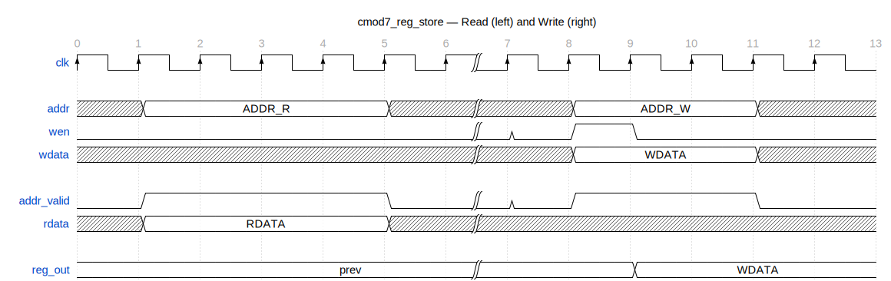
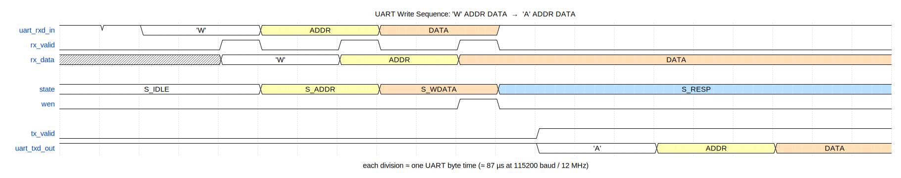

# Register Implementation

This document describes how the CMOD A7 / DE10-Nano register map is defined,
generated, and connected to the hardware design.

## Architecture Overview

```
regs/cmod7_regs.yaml          ← single source of truth
        │
        ▼
  regio-elaborate              ← parses YAML → internal IR (JSON)
        │
        ├──▶ regio-generate -g sv  ──▶ src/gen/cmod7_reg_store.sv
        │                                  (Verilog register storage module)
        │
        ├──▶ regio-generate -g sv  ──▶ src/gen/cmod7_reg_pkg.sv
        │                                  (Verilog `define constants)
        │
        └──▶ regio-generate -g py  ──▶ tools/gen/cmod7_block.py
                                           (Python address/name dicts)

src/gen/cmod7_reg_store.sv
        │  instantiated by
        ▼
src/reg_ctrl.v                ← UART transport wrapper
        │  drives internal bus
        └── addr / wdata / wen / rdata / addr_valid
```

The YAML file is the only file that is hand-edited. All downstream Verilog,
header, and Python files are regenerated by `make reggen` and are excluded
from version control.

---

## Register Map

| Addr | Name       | Access | Width | Reset | Description                         |
|------|------------|--------|-------|-------|-------------------------------------|
| 0x00 | `led_ctrl` | R/W    | 2     | 0x00  | LED override values — bit[1:0] = LED[1:0] |
| 0x01 | `led_mode` | R/W    | 1     | 0x00  | 0 = auto counter blink, 1 = manual  |
| 0x02 | `pwm_duty` | R/W    | 8     | 0x00  | PWM duty cycle (0 = 0%, 255 = 100%) |
| 0x03 | `pwm_mode` | R/W    | 1     | 0x00  | 0 = auto breathing, 1 = manual      |
| 0x04 | `cnt_hi`   | RO     | 8     | —     | counter[23:16] snapshot             |
| 0x05 | `cnt_mid`  | RO     | 8     | —     | counter[15:8] snapshot              |
| 0x06 | `cnt_lo`   | RO     | 8     | —     | counter[7:0] snapshot               |
| 0x07 | `version`  | RO     | 8     | 0xA7  | Board identifier                    |

Addresses 0x08–0xFF return NAK on read and are silently ignored on write.

---

## The YAML Spec: `cmod7_regs.yaml`

`regs/cmod7_regs.yaml` is the single authoritative definition of the register
map. All other representations — Verilog RTL, address constants, Python dicts —
are generated from it.

### Top-level structure

```yaml
name: cmod7          # block name → module prefix (cmod7_reg_store)
data_width: 8        # bus width in bits; applies to addr, wdata, rdata

regs:
  - default:         # default attributes for all registers that follow
      width: 8
      access: rw

  - name: led_ctrl   # register name → lowercase snake_case in Verilog
    desc: ...
    fields:          # optional field breakdown within the register
      - name: led
        width: 2     # effective bit width (overrides register default)
        desc: ...
```

### Register attributes

| Attribute | Values       | Notes |
|-----------|-------------|-------|
| `name`    | string       | Converted to `name_lower` / `name_upper` in templates |
| `access`  | `rw`, `ro`   | RW registers get output ports; RO registers get input ports |
| `width`   | integer      | Default width if no fields are specified |
| `init`    | hex integer  | Reset value for RW registers (default 0) |
| `desc`    | string       | Passed into generated file headers |
| `fields`  | list         | Optional sub-field definitions with `name`, `width`, `enum` |

Offsets are **not specified**. regio assigns them consecutively in declaration
order starting at 0x00. The `default:` entry sets attributes inherited by every
subsequent register unless overridden.

### Field attributes

| Attribute | Notes |
|-----------|-------|
| `name`    | Used in generated `define` names and Python constants |
| `width`   | Bit count; determines `computed_width` for the parent register |
| `enum`    | Optional integer → name mapping; documents legal values |

When fields are present, `computed_width` equals the sum of field widths rather
than the register default width. This controls the width of the output port in
the generated Verilog module.

---

## regio — the Code Generation Tool

[regio](https://github.com/esnet/regio) is ESnet's register map generator. It
is a **build-time tool dependency**, not vendored into this repository.

### Installation

regio is not on PyPI. Install from source:

```bash
git clone https://github.com/esnet/regio /tmp/regio
cd /tmp/regio && pip3 install .
```

Verify: `regio-elaborate --help` and `regio-generate --help` should both work.

### Two-phase generation

regio separates parsing from rendering:

**Phase 1 — `regio-elaborate`**: Parses the YAML, resolves defaults and
inheritance, auto-assigns offsets, computes derived values (`computed_width`,
`computed_size`, field masks and shifts), and emits a self-contained JSON
intermediate representation (IR). The IR contains everything the templates
need — no further YAML parsing occurs during rendering.

```bash
regio-elaborate -f block -i regs/ regs/cmod7_regs.yaml
```

The `-f block` flag selects the "block" format (a flat list of registers, as
opposed to a hierarchical bus tree). The `-i regs/` flag overrides regio's
default include-directory search (which otherwise looks for a `blocks/`
subdirectory in the working directory).

**Phase 2 — `regio-generate`**: Reads the IR on stdin and renders Jinja2
templates from a directory supplied with `-t`. The `-g` flag selects the
generator name (`sv`, `svh`, `c`, `py`), which determines the template
filenames that regio looks for inside the template directory. The `-o` flag
sets the output directory.

```bash
echo "$IR" | regio-generate -f block -g sv -t regs/templates/common -o src/gen -
```

The trailing `-` tells regio to read the IR from stdin rather than a file.

### Why custom templates?

regio's built-in templates generate SystemVerilog with an AXI4-Lite bus
interface, targeting large SoC designs. This project uses:

- **Verilog-2001** (not SystemVerilog) for Xilinx and Intel compatibility
- An 8-bit byte-addressed bus (`addr/wdata/wen/rdata/addr_valid`) that maps
  directly to the UART byte protocol
- No AXI handshake overhead

Custom templates in `regs/templates/common/` replace the built-in ones
entirely.

---

## Generation Pipeline: `regs/generate.sh`

```bash
#!/bin/bash
set -e
SCRIPT_DIR="$(cd "$(dirname "$0")" && pwd)"
PROJECT_DIR="$(dirname "$SCRIPT_DIR")"
YAML="$SCRIPT_DIR/cmod7_regs.yaml"
TMPL="$SCRIPT_DIR/templates/common"

mkdir -p "$PROJECT_DIR/src/gen" "$PROJECT_DIR/tools/gen"

IR=$(regio-elaborate -f block -i "$SCRIPT_DIR" "$YAML")

echo "$IR" | regio-generate -f block -g sv  -t "$TMPL" -o "$PROJECT_DIR/src/gen" -
mv "$PROJECT_DIR/src/gen/cmod7_reg_blk.sv" "$PROJECT_DIR/src/gen/cmod7_reg_store.sv"

echo "$IR" | regio-generate -f block -g py  -t "$TMPL" -o "$PROJECT_DIR/tools/gen" -

touch "$PROJECT_DIR/tools/gen/__init__.py"
```

Key steps:

1. **Elaborate once**, store the IR in a shell variable. Both generate passes
   read the same IR, avoiding double-parsing.
2. **Rename after generate**: regio names the `-g sv` output `cmod7_reg_blk.sv`
   (derived from the block name). It is renamed to `cmod7_reg_store.sv` to
   reflect the module's role as a pure storage layer rather than a complete
   register block with transport logic.
3. **`__init__.py`**: The generated Python files land in `tools/gen/`, which
   must be a Python package. regio does not create this file, so `generate.sh`
   touches it.

The script is invoked via `make reggen`, which uses a file target so it only
runs when `cmod7_regs.yaml` or the templates are newer than the generated
output:

```makefile
REGGEN_INPUTS = regs/cmod7_regs.yaml $(wildcard regs/templates/*.j2)

src/gen/cmod7_reg_store.sv: $(REGGEN_INPUTS)
    ./regs/generate.sh

reggen: src/gen/cmod7_reg_store.sv
```

Any sim or build target that lists `src/gen/cmod7_reg_store.sv` in its
prerequisites will trigger `make reggen` automatically.

---

## Jinja2 Templates

Templates live in `regs/templates/common/`. The directory name `common`
signals that these templates generate transport-agnostic register storage.
Future transport-specific wrappers (e.g. `regs/templates/pcie/`) would add
subdirectories alongside it.

regio resolves template filenames from the generator name. For `-g sv -f block`
it looks for three files; for `-g py -f block` it looks for two. All five must
exist in the template directory even if some are stubs.

### `reg_blk_sv.j2` — Verilog register storage module

**Output**: `src/gen/cmod7_reg_store.sv`

This is the primary template. It generates the complete `cmod7_reg_store`
Verilog module.

Key template logic:

```jinja
module {{ blk.name_lower }}_reg_store (
    input  wire        clk,
    input  wire [{{ blk.data_width - 1 }}:0]  addr,
    ...


    output reg  [{{ reg.computed_width - 1 }}:0]  {{ reg.name_lower }},




    input  wire [{{ blk.data_width - 1 }}:0]  {{ reg.name_lower }}_ro...


);
```

- RW registers become `output reg` ports, sized to `computed_width` (not the
  full `data_width`). A 1-bit field produces a `[0:0]` port; a 2-bit field
  produces `[1:0]`.
- RO registers become `input wire [data_width-1:0]` ports with a `_ro` suffix.
  Their values are driven externally (e.g. counter bits, tied constants).

Read mux — explicit zero-extension when `computed_width < data_width`:

```jinja


    {{ addr }}: rdata_mux = {{ '{' }}{{ pad }}'b0, {{ reg.name_lower }}{{ '}' }};

    {{ addr }}: rdata_mux = {{ reg.name_lower }};

```

This prevents width-mismatch warnings in Verilator and Vivado.

### `reg_pkg_sv.j2` — Verilog address and field constants

**Output**: `src/gen/cmod7_reg_pkg.sv`

Generates `` `define `` macros for register addresses and field masks/shifts:

```jinja
`define {{ blk.name_upper }}_{{ reg.name_upper }}_ADDR  {{ width }}'h{{ offset }}
`define {{ blk.name_upper }}_{{ reg.name_upper }}_{{ field.name_upper }}_MASK   ...
`define {{ blk.name_upper }}_{{ reg.name_upper }}_{{ field.name_upper }}_SHIFT  ...
```

Intended for testbenches or other Verilog that needs to reference register
addresses by name rather than literal hex. Not currently included in the DUT
source list (no production RTL uses it), but available for simulation use.

### `block_py.j2` — Python register definitions

**Output**: `tools/gen/cmod7_block.py`

Generates three Python-level artifacts consumed by the host tools:

```jinja
{{ blk.name_upper }}_{{ reg.name_upper }} = 0x{{ offset }}   # address constant

REGISTER_NAMES  = { 0x{{ offset }}: "{{ reg.name_upper }}", ... }
REGISTER_ACCESS = { 0x{{ offset }}: "{{ reg.access }}", ... }
```

`tools/reg_access.py` and `tools/reg_access_jtag.py` import `REGISTER_NAMES`
to display symbolic names in read/write output. `tools/sim_console.py` uses
both `REGISTER_NAMES` and `REGISTER_ACCESS` to label registers and update the
shadow map correctly (only RW registers are shadowed).

### `reg_intf_sv.j2` — interface stub (required, unused)

regio's `-g sv` generator unconditionally looks for this template and renders
it to `cmod7_reg_intf.sv`. The UART byte protocol has no use for a SystemVerilog
interface, so the template contains only a comment. The output file is ignored
and not added to any source list.

### `decoder_py.j2` — decoder stub (required, unused)

regio's `-g py` generator looks for this template to generate address decoders
for hierarchical bus trees. The flat single-block design has no decoders. The
template is a one-line comment; regio renders and discards the output.

---

## Generated Module: `cmod7_reg_store`

### Port table

| Port | Width | Dir | Description |
|------|-------|-----|-------------|
| `clk` | 1 | in | System clock (posedge) |
| `addr` | 8 | in | Register address |
| `wdata` | 8 | in | Write data |
| `wen` | 1 | in | Write enable (combinational; sampled on posedge `clk`) |
| `rdata` | 8 | out | Read data (combinational) |
| `addr_valid` | 1 | out | High when `addr` is in range 0x00–0x07 (combinational) |
| `led_ctrl` | 2 | out | R/W register output |
| `led_mode` | 1 | out | R/W register output |
| `pwm_duty` | 8 | out | R/W register output |
| `pwm_mode` | 1 | out | R/W register output |
| `cnt_hi_ro` | 8 | in | RO register input (counter[23:16]) |
| `cnt_mid_ro` | 8 | in | RO register input (counter[15:8]) |
| `cnt_lo_ro` | 8 | in | RO register input (counter[7:0]) |
| `version_ro` | 8 | in | RO register input (tied to 0xA7) |

### Bus timing



<!-- wavedrom source (regenerate: npx wavedrom-cli -i /tmp/reg-store-bus.json -s regs/docs/img/reg-store-bus.svg)
```json
{ "signal": [
    { "name": "clk",        "wave": "P.....|......" },
    {},
    { "name": "addr",       "wave": "x2...x|x2..x.", "data": ["ADDR_R", "ADDR_W"] },
    { "name": "wen",        "wave": "0.....|010..." },
    { "name": "wdata",      "wave": "x.....|x2..x.", "data": ["WDATA"] },
    {},
    { "name": "addr_valid", "wave": "01...0|01..0." },
    { "name": "rdata",      "wave": "x2...x|......", "data": ["RDATA"] },
    {},
    { "name": "reg_out",    "wave": "2.....|..2...", "data": ["prev", "WDATA"] }
  ],
  "head": { "text": "cmod7_reg_store — Read (left) and Write (right)", "tick": 0 },
  "config": { "hscale": 2 }
}
```
-->

Left half shows a read: `addr` is presented for one cycle, `addr_valid` and `rdata` respond combinationally. Right half shows a write: `wen` is asserted for one cycle, `reg_out` updates on the next posedge.

### Address validity

```verilog
assign addr_valid = (addr <= 8'h07);
```

Purely combinational. The transport wrapper checks `addr_valid` on the same
cycle it presents the address, before committing a write or building a
response.

### Combinational read mux

`rdata` is a wire driven by an `always @(*)` mux. It is valid on the same
clock cycle that `addr` is presented — no registered read latency.

```verilog
reg [7:0] rdata_mux;
always @(*) begin
    case (addr)
        8'h00: rdata_mux = {6'b0, led_ctrl};   // zero-extend 2-bit field
        8'h01: rdata_mux = {7'b0, led_mode};   // zero-extend 1-bit field
        8'h02: rdata_mux = pwm_duty;
        8'h03: rdata_mux = {7'b0, pwm_mode};
        8'h04: rdata_mux = cnt_hi_ro;
        8'h05: rdata_mux = cnt_mid_ro;
        8'h06: rdata_mux = cnt_lo_ro;
        8'h07: rdata_mux = version_ro;
        default: rdata_mux = 8'h00;
    endcase
end
assign rdata = rdata_mux;
```

### Synchronous write

Writes are registered on the rising edge of `clk` when `wen` is asserted.
Only RW registers are writable; writes to RO addresses are silently ignored
(there is no write case for them).

```verilog
always @(posedge clk) begin
    if (wen && addr == 8'h00) led_ctrl <= wdata[1:0];
    if (wen && addr == 8'h01) led_mode <= wdata[0:0];
    if (wen && addr == 8'h02) pwm_duty <= wdata[7:0];
    if (wen && addr == 8'h03) pwm_mode <= wdata[0:0];
end
```

Each condition is independent (`if` / `if`, not `if` / `else if`) because only
one address can match at a time, and the pattern avoids priority encoding.

### Power-on initial values

```verilog
initial begin
    led_ctrl = 2'h0;
    led_mode = 1'h0;
    pwm_duty = 8'h0;
    pwm_mode = 1'h0;
end
```

Synthesis-time initialisation. Both Xilinx (Vivado) and Intel (Quartus) support
`initial` blocks for flip-flop reset values. There is no runtime reset port;
`rst` is tied to `1'b0` in both platform tops.

---

## Transport Wrapper: `reg_ctrl.v`

`reg_ctrl.v` implements the UART Ping/Read/Write protocol FSM and uses
`cmod7_reg_store` as its register backing store. It drives the internal bus
combinationally so that reads and writes complete in the same clock cycle as
the FSM processes the incoming UART byte.

### Internal bus wiring

```verilog
// Address: rx_data in S_ADDR (read path), cmd_addr in S_WDATA (write path)
assign rf_addr = (state == S_ADDR) ? rx_data : cmd_addr;

// Write enable: combinational so reg_store writes on the same posedge
assign rf_wen  = (state == S_WDATA) && rx_valid;
```

`rf_addr` is presented to `cmod7_reg_store` one cycle before the write
happens, so `addr_valid` and `rdata` are both available combinationally when
the FSM transitions.

### Instantiation

```verilog
cmod7_reg_store u_reg_store (
    .clk        (clk),
    .addr       (rf_addr),
    .wdata      (rx_data),
    .wen        (rf_wen),
    .rdata      (rf_rdata),
    .addr_valid (rf_addr_valid),
    .led_ctrl   (rf_led_ctrl),
    .led_mode   (rf_led_mode),
    .pwm_duty   (rf_pwm_duty),
    .pwm_mode   (rf_pwm_mode),
    .cnt_hi_ro  (counter[23:16]),
    .cnt_mid_ro (counter[15:8]),
    .cnt_lo_ro  (counter[7:0]),
    .version_ro (8'hA7)
);
```

`version_ro` is tied directly to the constant `0xA7`. Counter fields are sliced
from the 24-bit free-running counter passed into `reg_ctrl` from the platform
top.

### UART write sequence



<!-- wavedrom source (regenerate: npx wavedrom-cli -i /tmp/uart-write-sequence.json -s regs/docs/img/uart-write-sequence.svg)
```json
{ "signal": [
    { "name": "uart_rxd_in",  "wave": "112..3..4..1.........", "data": ["'W'", "ADDR", "DATA"] },
    { "name": "rx_valid",     "wave": "0...10.10.10........." },
    { "name": "rx_data",      "wave": "x...2..3..4..........", "data": ["'W'", "ADDR", "DATA"] },
    {},
    { "name": "state",        "wave": "2....3..4..5.........", "data": ["S_IDLE", "S_ADDR", "S_WDATA", "S_RESP"] },
    { "name": "wen",          "wave": "0.........10........." },
    {},
    { "name": "tx_valid",     "wave": "0...........1........" },
    { "name": "uart_txd_out", "wave": "1...........2..3..4..", "data": ["'A'", "ADDR", "DATA"] }
  ],
  "head": { "text": "UART Write Sequence: 'W' ADDR DATA  →  'A' ADDR DATA" },
  "foot": { "text": "each division ≈ one UART byte time (≈ 87 µs at 115200 baud / 12 MHz)" },
  "config": { "hscale": 2 }
}
```
-->

The FSM advances through S_IDLE → S_ADDR → S_WDATA → S_RESP as bytes arrive from the UART RX path. `wen` pulses for one cycle when the data byte is accepted; `uart_txd_out` then echoes `'A' ADDR DATA` as the acknowledgement.

### Why the split matters

`reg_ctrl.v` knows about UART framing, baud rate, and the Ping/Read/Write
command encoding. `cmod7_reg_store` knows nothing about UART. This separation
means:

- The register storage module is synthesisable and simulatable without any
  transport logic.
- A different transport (PCIe BAR access, AXI4-Lite, file I/O) instantiates
  the same `cmod7_reg_store` and drives the same five-wire internal bus.
- The YAML spec and templates are not touched when adding a transport.

---

## Adding a New Transport

To add a second transport (example: a simple memory-mapped AXI4-Lite wrapper):

1. **Write the transport RTL** in `src/` (e.g. `axi_reg_ctrl.v`). Instantiate
   `cmod7_reg_store` and translate AXI read/write channels to the
   `addr/wdata/wen/rdata/addr_valid` bus.

2. **Add transport-specific templates** (optional) in
   `regs/templates/axi/` if you want to auto-generate a C header or Python
   struct from the same YAML spec. Add a `regio-generate` pass in
   `generate.sh` pointing at that directory.

3. **Wire in the platform top**: add the new transport module alongside
   `reg_ctrl` in the appropriate `top.v`. Both transports share the same
   `cmod7_reg_store` instance — the internal bus is the join point.

No changes are required to `cmod7_regs.yaml`, `cmod7_reg_store.sv`, or any
existing transport.

### Template directory convention

```
regs/templates/
  common/     ← transport-agnostic storage (this document)
  uart/       ← future: UART wrapper template (if desired)
  pcie/       ← future: PCIe BAR wrapper template
  fileio/     ← future: file-descriptor / mmap wrapper template
```

Each subdirectory is a self-contained regio template set passed via `-t`.
Transport-specific templates generate only the wrapper glue; the storage module
always comes from `common/`.
